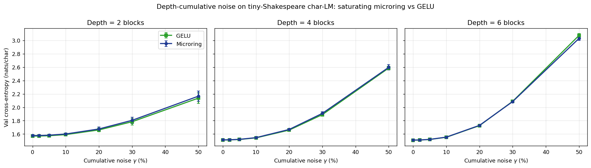
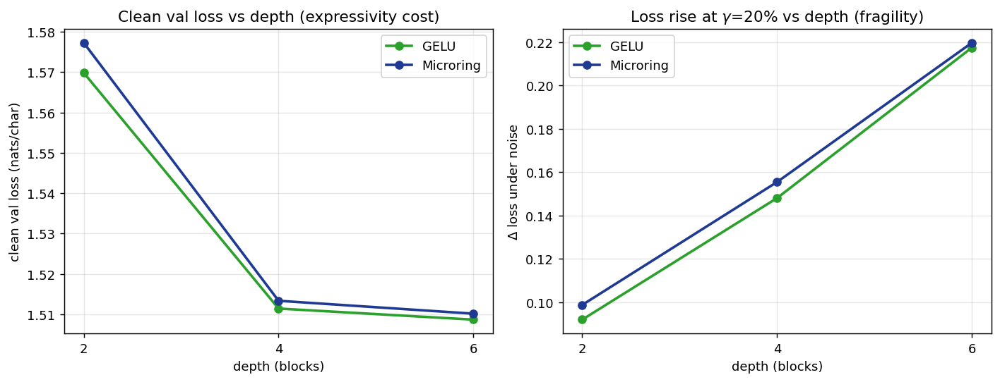

# Linearity Is a Regime, Not a Law

Reproducibility code for the paper **"Linearity Is a Regime, Not a Law: Frequency
Degrees of Freedom as Native Nonlinearity Primitives for Optical Computing"**
(M. C. Özdemir, independent researcher).

The paper argues that the maxim *"optics is linear"* describes the weak-field
χ⁽¹⁾ **regime**, not a law: the χ⁽²⁾E² and χ⁽³⁾E³ terms that generate new
frequencies are exactly the terms that make the effective transfer function
nonlinear, so frequency degrees of freedom can serve as native nonlinearity
primitives. This repo holds the numerical proof-of-concept simulations behind
the paper's figures. Everything here is **idealized modeling — there is no
fabricated device.**

## Contents

| Script | Paper | Output |
|---|---|---|
| `sim_microring_activation.py` | §6.1 | `figures/fig_activation.*` — Kerr microring drop-port self-action curve, fit to sigmoid (R²=0.986) / GELU (0.889) / SiLU (0.885), operated just below the √3 bistability threshold. Also writes `figures/act_{xn,yn}.npy`. |
| `sim_energy_budget.py` | §6.2 | `figures/fig_energy.*` — electronic O/E→act→E/O (~11 pJ) vs all-optical χ⁽²⁾ path vs bandwidth; the all-optical path wins only below ≈0.19 GHz. |
| `sim_architecture_diagram.py` | §4 | `figures/fig_architecture.*` — schematic of the proposed frequency-native nonlinearity pipeline (no computation). |
| `deep_noise_study.py` | §6.3 | `figures/fig_depth_noise.*`, `figures/fig_expressivity_tradeoff.*` — **the central result** (see below). |
| `sim_singleblock_noise_probe.py` | §6.3 (superseded) | `figures/fig_noise.*` — the misleading shallow probe; kept only for transparency. |

## The central result (§6.3)

`deep_noise_study.py` trains character-level transformers on tiny-Shakespeare
(~1.1M chars, held-out validation) across depths **L ∈ {2, 4, 6}**, with GELU
versus a genuinely **saturating microring activation** (R²=0.930 to GELU over its
operating range, saturating beyond). To emulate amplified-spontaneous-emission
(ASE) accumulation, zero-mean Gaussian noise of relative std **γ** — scaled per
token by the residual-stream RMS — is injected **after every block**, so a depth-L
network accumulates L insertions. We report teacher-forced validation
cross-entropy in the **compute-bound / prefill regime** (not autoregressive
decode, which the paper places out of optical reach), averaged over 3 seeds.

Three findings, all honest to a fault:

1. **Noise accumulates multiplicatively with depth** (confirms §5.3): the
   noise-induced loss rise at γ=20% grows **0.09 → 0.15 → 0.22 nats** from
   L=2 → 4 → 6; at γ=50% validation loss climbs ≈2.1 → 2.6 → 3.1 nats.
2. **No activation robustness advantage:** GELU and the saturating microring are
   statistically indistinguishable under noise (differences ≤0.014 nats, within
   the seed-to-seed scatter of ≈0.02–0.03).
3. **Small expressivity cost:** the clean-loss gap is ≤0.007 nats and *shrinks*
   with depth — the network compensates for the weaker pointwise map.

The single-block probe (`sim_singleblock_noise_probe.py`) instead suggests the
microring is *more* noise-robust. That is a shallow-depth, task-ceiling artifact
that does **not** survive the depth-resolved study; it is included solely to make
the reversal transparent.




## Requirements

Python ≥ 3.10 and:

```bash
pip install -r requirements.txt   # numpy, scipy, matplotlib, torch
```

A CUDA GPU is recommended for the two PyTorch scripts, but they fall back to CPU.
Developed and run on an NVIDIA GB10 (Grace-Blackwell) box; nothing is
hardware-specific.

## Reproduce every figure

```bash
python sim_microring_activation.py     # writes act_*.npy used by the probe
python sim_energy_budget.py
python sim_architecture_diagram.py
python deep_noise_study.py             # auto-downloads tiny-shakespeare (~1 MB)
python sim_singleblock_noise_probe.py  # optional, superseded
```

Figures land in `figures/`. Reference outputs are already committed there.

## Citation

Paper under preparation; an arXiv link will be added here on posting.

## License

MIT — see [`LICENSE`](LICENSE).
