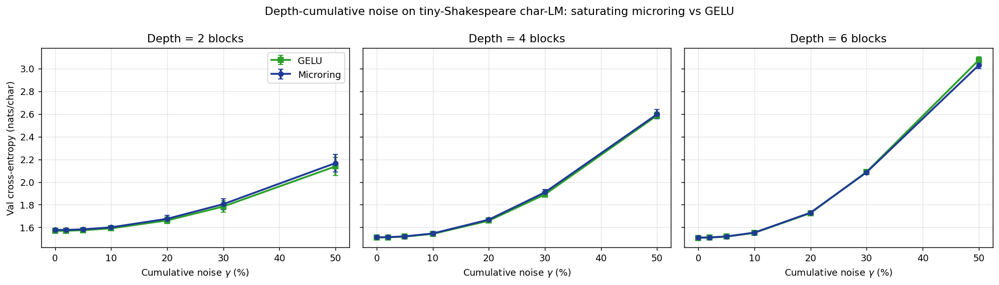
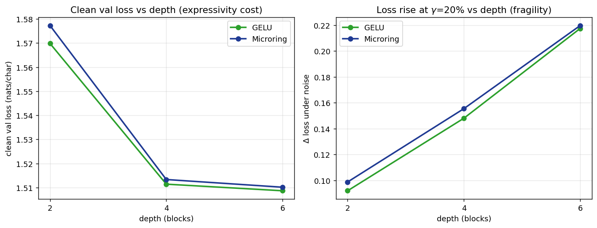

# Linearity Is a Regime, Not a Law

[](https://doi.org/10.5281/zenodo.21712172)
[](LICENSE)

Reproducibility code for the paper **"Linearity Is a Regime, Not a Law: Frequency
Degrees of Freedom as Native Nonlinearity Primitives for Optical Computing"**
(M. C. Özdemir, independent researcher).

The paper argues that the maxim *"optics is linear"* describes the weak-field
χ⁽¹⁾ **regime**, not a law: the χ⁽²⁾E² and χ⁽³⁾E³ terms that generate new
frequencies are the terms that **can** make the effective transfer function
nonlinear — but not always. Under a fixed pump, a mixing stage generates new
frequencies and still acts linearly on the computational input. The paper's
Criterion 1 states when a higher-order process is *computationally* nonlinear:
when operands multiply, when an input writes a pump or device parameter, or
when self-action makes the scattering operator input-dependent. It is that
third route the code models.

This repo holds the numerical models behind the paper's figures. Everything here
is **idealized modelling — no device was fabricated or measured.**

The headline result is negative, and that is the point: once the activation
bank's own optical drive is charged at the *ring's* bandwidth rather than the
system's, it sets a bandwidth-independent floor of **≈0.70 pJ/MAC**, seven times
the 0.1 pJ/MAC reference digital baseline. The code is what makes that auditable.

---

## Reproducing every figure

```bash
pip install -r requirements.txt

# Figs. 1-2, 4  (architecture schematic, roofline, chi(2) vs O/E comparison)
python3 sim_architecture_diagram.py
python3 sim_roofline.py
python3 sim_energy_budget.py

# Fig. 3   (microring activation curve + self-consistency assert)
python3 sim_microring_activation.py

# Sec. IV-B softmax cascade (self-action vs externally detuned)
python3 sim_softmax_cascade.py

# Figs. 6-8  (energy map, independent-parameter tornado, Q optimum)
python3 sim_ppa_breakeven.py

# Fig. 5 + noise study.  The depth sweep is the long one (GPU, ~20 min for L=8,12).
python3 deep_noise_study.py      # depths 2,4,6            -> deep_noise_v3.json
python3 deep_noise_deep.py       # extends to 8,12         -> deep_noise_all.json
python3 deep_noise_dual.py       # constant vs sqrt arms   -> deep_noise_dual.json
python3 deep_noise_cm.py         # common-mode drift arm   -> deep_noise_cm.json
python3 deep_noise_phase.py      # complex-phase probe     -> deep_noise_phase.json
python3 plot_depth_noise.py
python3 plot_expressivity.py

# Statistical check on the depth scaling law (no new experiment needed)
python3 analysis_heldout.py

# Optional: the shallow single-block probe, kept only to make a reversal transparent
python3 sim_singleblock_noise_probe.py
```

Figures are written to `figures/`; reference outputs are committed there. The
depth scripts expect `input.txt` (tiny-Shakespeare) in the working directory.

## Requirements

Python >= 3.10 and `numpy`, `scipy`, `matplotlib`, `torch` (see
[`requirements.txt`](requirements.txt)). Exact versions used for the reported
runs are recorded in [`ENVIRONMENT.md`](ENVIRONMENT.md).

The five `deep_noise_*.py` scripts train small transformers and want a CUDA GPU;
they fall back to CPU. Everything else is CPU-only and deterministic. Developed
on an NVIDIA GB10 (Grace-Blackwell) box; nothing is hardware-specific.

---

## Contents

| Script | Paper | Output |
|---|---|---|
| `sim_microring_activation.py` | VI-A | `figures/fig_activation.*` — Kerr microring drop-port self-action curve, fit to sigmoid (R²=0.986) / GELU (0.889) / SiLU (0.885), operated just below the √3 bistability threshold. Also writes `figures/act_{xn,yn}.npy`. |
| `sim_energy_budget.py` | VI-B | `figures/fig_energy.*` — electronic O/E→act→E/O (~11 pJ) vs all-optical χ⁽²⁾ path vs bandwidth; the all-optical path wins only below ≈0.19 GHz. |
| `sim_ppa_breakeven.py` | VI-D | `figures/fig_ppa_breakeven.*`, `fig_ppa_tornado.*`, `fig_act_qopt.*` — core-level energy accounting for a 256×256 optical tensor core, the independent-parameter sensitivity tornado, and the ring-Q optimisation of the activation bank. |
| `sim_roofline.py` | V-F | `figures/fig_roofline.*` — roofline showing autoregressive decode is memory-bound at batch 1 and saturates at a KV-set plateau under batching, while only high-reuse prefill and the forward pass of training reach the compute-bound regime an optical ceiling can lift. |
| `sim_architecture_diagram.py` | IV | `figures/fig_architecture.*` — schematic of the hybrid pipeline (no computation). |
| `sim_softmax_cascade.py` | IV-B | Compares two ways to synthesize the softmax exponential from ring cascades: externally detuned stages (1.8% worst-case error at N=3, 4.0 dB loss, improving with N) versus self-action stages solved self-consistently from the paper's cubic (14–17%, not improving). Supports the scoping claim that self-action shapes the activation, not the exponential. |
| `deep_noise_study.py` | VI-C | `deep_noise_v3.json` — depths L in {2,4,6}, GELU vs saturating microring surrogate, Gaussian residual-domain noise after every block. |
| `deep_noise_deep.py` | VI-C | `deep_noise_all.json` — extends the sweep to L = 8 and 12, giving the five-depth fit with a = 2.07 ± 0.04, b = 0.73 ± 0.04 (the L ≤ 6 fit alone reads b = 0.58 and under-predicts L = 12). |
| `deep_noise_dual.py` | VI-C | `deep_noise_dual.json` — each model trained once, evaluated under BOTH the constant-relative arm and a sqrt-scaled (intensity-encoding ASE) arm at equal mean injected noise power. The sqrt arm is marginally harsher at depth (≤0.05 nats), leaving every conclusion unchanged. |
| `deep_noise_cm.py` | VI-C | `deep_noise_cm.json` — correlated common-mode drift arm (see below). |
| `deep_noise_phase.py` | VI-A | `deep_noise_phase.json` — complex-phase probe (see below). |
| `analysis_heldout.py` | VI-C | Held-out extrapolation test on the existing data; no new experiment. |
| `plot_depth_noise.py`, `plot_expressivity.py` | VI-C (figures) | Re-plot `fig_depth_noise.*` and `fig_expressivity_tradeoff.*` in the single-column form used in the paper. The expressivity panel was dropped from the final paper and is kept as supplementary. |
| `sim_singleblock_noise_probe.py` | VI-C (superseded) | `figures/fig_noise.*` — the misleading shallow probe; kept only for transparency. |

---

## What the noise study establishes

`deep_noise_study.py` and `deep_noise_deep.py` train character-level transformers
on tiny-Shakespeare (~1.1M chars, held-out validation) across depths
**L in {2, 4, 6, 8, 12}**, with GELU versus a **saturating microring surrogate**
(R² = 0.930 to GELU over its operating range). To emulate
amplified-spontaneous-emission accumulation, zero-mean Gaussian noise of relative
std **gamma** — scaled per token by the residual-stream RMS — is injected **after
every block**, so a depth-L network accumulates L insertions. We report
teacher-forced validation cross-entropy in the compute-bound / prefill regime,
averaged over 3 seeds.

Three findings:

1. **Degradation is quadratic in noise amplitude and sub-linear in depth:**
   a = 2.07, b = 0.73 over five depths.
2. **No activation robustness advantage:** GELU and the saturating surrogate are
   statistically indistinguishable under noise, within seed-to-seed scatter.
3. **Small expressivity cost:** the clean-loss gap is ≤0.007 nats and *shrinks*
   with depth.

Scope, stated the way the paper states it: this is a **residual-domain Gaussian
perturbation model**, not a physical amplifier chain — no signal–ASE or ASE–ASE
beat, no phase noise, no gain saturation, no amplifier placement. Finding (2)
holds under the tested model and should not be generalised to all coherent
optical amplifier topologies.




### Common-mode drift arm

`deep_noise_cm.py` adds a third arm: a per-token **common-mode scalar** (the same
shift on every feature, at equal per-feature noise power), modelling correlated
die-level resonance drift against the paper's independent arm. Result: the
common-mode arm is indistinguishable from the clean run to six decimal places at
every depth and every gamma up to 50%. The immunity is structural — every
consumption point in a pre-norm transformer passes a LayerNorm, whose
mean-subtraction kills a feature-uniform offset exactly and whose variance
division kills a common gain to O(eps). What this arm does **not** capture: a real
resonance shift deforms the activation curve, and the first-order residue is
x-dependent and survives normalisation. That residue is flagged in the paper as
unmodelled.

Note the co-design tension the paper draws out: the immunity above is supplied by
LayerNorm, and one of the paper's own suggested partners is a normalisation-free
(Dynamic Tanh) design. The two savings are not additive.

### Complex-phase probe

`deep_noise_phase.py` addresses the paper's largest stated scope limit. The ring
returns a **complex** coefficient `t(u)` whose argument sweeps ≈97° over the
operating range, so a coherent mesh with homodyne readout sees `Re t`, not `|t|`.
The script solves the cubic for the true `t(u)` and evaluates amplitude-trained
weights under three arms. Those weights lose ≈0.04 nats under `Re t`; a single
global static compensation recovers none of it (the mean `arg t` is only 2.6°, so
the residue is x-dependent, not a constant offset); retraining under the complex
map recovers the loss. The phase therefore looks like a **train–deploy mismatch
rather than a loss of expressivity** — but this is two seeds at one depth on a
surrogate network, and the paper reports it as a probe, not a result.

---

## Corrections that changed the numbers

This section is kept deliberately. Several confident-looking figures in earlier
drafts were wrong, and were caught by re-deriving them rather than by inspection.
Anyone reusing this code should know which numbers moved, and why.

### The characteristic drive power `P_c`

All power figures are quoted for **thin-film lithium niobate**, adopted as the
*monolithic reference platform*: it supports both the χ⁽²⁾ operations considered
here and Kerr self-action without silicon's two-photon absorption at 1550 nm.
Within a monolithic design that choice is close to forced — mechanism (i)
requires χ⁽²⁾, which excludes centrosymmetric silicon and silicon nitride — but
it is **not** forced for the architecture in general; heterogeneous integration
could split the stages across materials.

Early drafts quoted `P_c ≈ 16 µW` (silicon) and then `≈ 0.33 mW` (TFLN n₂ with a
**silicon mode volume**). Both are wrong for this device. `V_eff` must be built
from the actual geometry: with `A_eff ≈ 1 µm²` and `R ≈ 20 µm`,
`V_eff ≈ 1.3e-16 m³` and **`P_c ≈ 14 mW`**.

`sim_microring_activation.py` now asserts the self-consistency condition that
catches this class of error — the coupled-mode normalisation requires the Kerr
index shift to reach half a linewidth at `P_in ~ P_c`, i.e. `dn = n0/2Q`, and the
buildup calculation must reproduce it:

    SELF-CONSISTENCY  dn_actual/dn_required = 1.10

The old `V_eff` returned 0.03. The assert fails if a future edit reintroduces an
inconsistent geometry.

Downstream anchors, all re-derived by the scripts: ENOB ≈ 11.7 bits at 10 GHz,
falling to ≈8.9 after one activation because the closed-form maximum slope is
`(1 - D^2/3)^-1 = 6.82` at the operating detuning; ASE gamma ≈ 0.13 % at `P_c`
against 0.68 % at 0.5 mW/channel; self-written parameter cost
`P_c/B_ring ≈ 36 pJ` (≈0.9 nJ at converter rate) against ≈4.3 pJ to write the
same parameter externally **on a common system boundary** (encoder + probe, not
encoder alone).

### The activation-drive floor

`sim_ppa_breakeven.py` once charged the activation bank as `Pact/(eta*Nch*B)`,
which implicitly assumes one activation per `1/B` and yielded an **obsolete**
0.027 pJ/MAC. A ring of loaded Q responds at its **own** linewidth
`B_ring = nu/Q ≈ 386 MHz`, not at the system symbol rate — so that form disagreed
with the per-activation figure `P_c/B_ring ≈ 36 pJ` by exactly `B/B_ring ≈ 26`.

Running the bank at B needs `M = B/B_ring` time-multiplexed replicas, so

    E_act = (Nch*M*P_c/eta) / (Nch^2 * B) = P_c/(eta * B_ring * Nch)

and **B cancels**: bandwidth buys replicas in proportion. The activation bank is
a *bandwidth-independent* floor of **≈0.70 pJ/MAC**. There is no parity anywhere
on the (B, P_heat) plane — the script checks this and refuses to draw a contour
that does not exist.

The one escape is ring Q: `P_c ~ Q^-2` and `B_ring ~ Q^-1` make the drive term
`~ Q^-1`, but the replica count and hence the bank's heater floor go `~ Q`. The
sum minimises at `Q* ≈ 4e6` at ≈0.17 pJ/MAC — still above baseline, needing
≈5.5e4 rings, i.e. **≈140–200 mm² at the 50–60 µm pitch** a 40-µm-diameter ring
with heater and keep-out actually occupies. That 0.17 is a **lower bound**: the
router width scales as M ~ Q, the absolute bistability margin narrows as 1/Q, the
mode volume grows with the radius that bend loss forces at high Q, and a servo at
1 mW/ring adds ≈0.084 pJ/MAC at Q*. All four push the true optimum left and up.

### Cross-phase modulation inside the ring

An earlier draft multiplied the 1 mm bus figure by the ring finesse and reported
≈16 rad of intra-ring XPM. That is wrong twice over: the enhancement of the path
integral is set by the resonant path length (≈60 mm, a factor of 60 over the bus)
rather than the finesse, and — decisively — the neighbouring planes are **not
resonant**. At 50 GHz channel spacing they sit ≈259 half-linewidths off and enter
suppressed by ≈1.5e-5. Intra-ring XPM at channel spacing is **≲0.1 mrad**, five
orders below the naive estimate. What the calculation *does* forbid is placing
planes one FSR apart on adjacent comb teeth, where they are co-resonant and the
cross-phase jumps to order tens of radians.

### A path bug that kept a figure stale

`plot_depth_noise.py` and `plot_expressivity.py` were writing their PDFs to the
repo root instead of `figures/`, so `figures/fig_depth_noise.*` stayed stale
across several revisions while appearing to be regenerated. Both now write to
`figures/`.

### Held-out extrapolation test

`analysis_heldout.py` measures the scaling law's real out-of-range error: fit on
L <= 8 only, predict the held-out L = 12. Under-prediction is -18..-24% for one
~1.5x range step; compounded to L = 96 that is x3-4, so the paper's central
extrapolation band is quoted as a floor and the L = 96 figure is an extrapolated
upper-range estimate, not a measurement.

---

## Citation

If you use this code, cite the archived release:

> M. C. Özdemir, *Linearity Is a Regime, Not a Law: reproducibility code for
> frequency degrees of freedom as native nonlinearity primitives for optical
> computing*, v1.0, Zenodo, 2026. doi:10.5281/zenodo.21712172

Machine-readable metadata is in [`CITATION.cff`](CITATION.cff). The journal
version is under review; this section will be updated with its DOI on acceptance.

## License

MIT — see [`LICENSE`](LICENSE).
